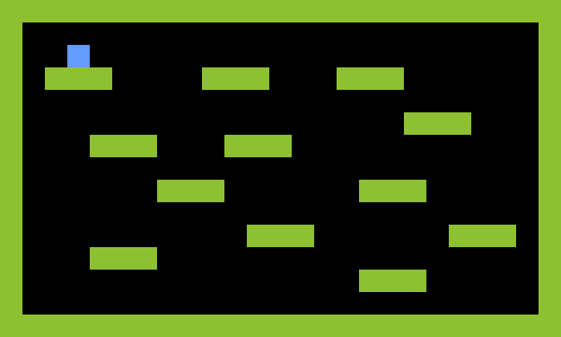

# boilerplate-phaser-game

:fork_and_knife: Starter of [Phaser.js](http://phaser.io) (simple game).

_Use ECMAScript 2016 syntax._

## Preview 🎉

<https://piecioshka.github.io/boilerplate-phaser-game/>

## Features

* :white_check_mark: Phaser v2.6.2
* :white_check_mark: Webpack v2.2.1
* :white_check_mark: Babel (ECMAScript 2015 + ECMAScript 2016 + Stage 0 of ECMAScript 2017)
* :white_check_mark: [super-event-emitter](http://github.com/piecioshka/super-event-emitter) v4.1.4 as event management
* :white_check_mark: Typings (`phaser`, `super-event-emitter`) for syntax highlighters
* :white_check_mark: Simple structure for app: `constants/`, `models/`, `states/`
* :white_check_mark: Example map (build in Tiled app)
* :white_check_mark: Static directory: `public/`
* :white_check_mark: Maximum 80 characters per line in each file!



## Steps to launch the project

```bash
npm install       # install dependencies
npm run build     # build distribution files in public/dist/
```

## Development

```bash
npm run typings   # support syntax highlighters
npm run watch     # run Webpack to listen of file modifications
```

## Misc

```bash
npm run clear     # remove all generated files
```

## License

[The MIT License](http://piecioshka.mit-license.org) @ 2016
